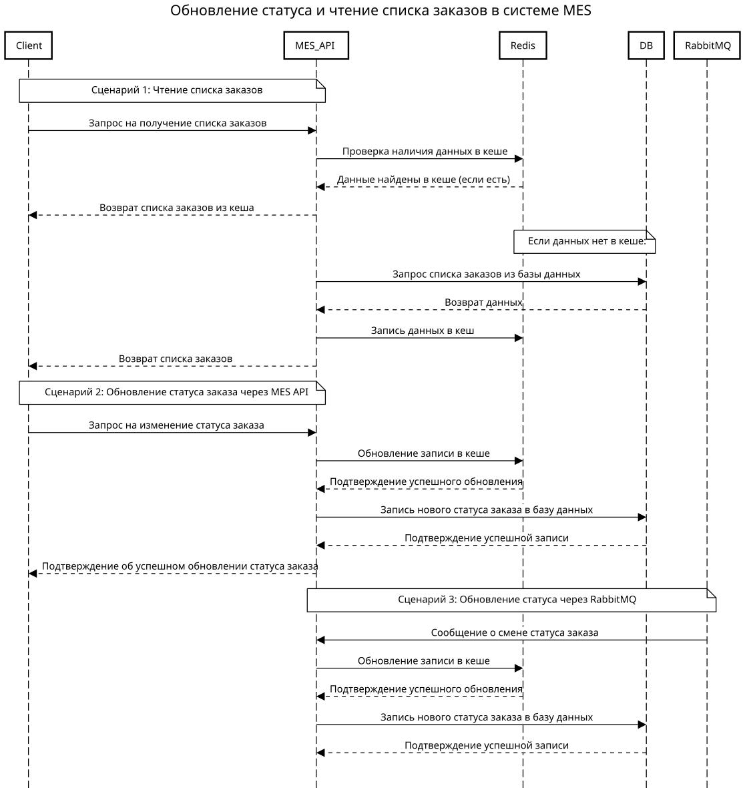

# Архитектурное решение по кешированию

## Мотивация
MES страдает от медленной работы при отображении страницы заказов и выполнения операций со статусами. Основные проблемы:
1. **Медленная загрузка страницы заказов**:
   - Дашборд отображает список заказов со статусами.
   - Большое количество запросов к базе данных перегружает систему.
2. **Длительное время расчёта стоимости заказа**:
   - Система перегружена.
3. **Низкая скорость обработки изменений статусов заказов**:
   - Многократные обновления статусов увеличивают нагрузку на базу данных.

**Цели кеширования**:
- Уменьшить нагрузку на базу данных.
- Ускорить отображение страницы заказов.
- Сократить время расчёта стоимости заказа.
- Повысить общую отзывчивость системы.

Элементы системы для кеширования:
- **Список заказов на дашборде** (сортировка и фильтрация).
- **Результаты расчёта стоимости заказа**.
- **Часто обновляемые статусы заказов**.

---

## Предлагаемое решение

### Выбор типа кеширования
- **Серверное кеширование**:
  - Лучше подходит, так как:
    - Обрабатывает данные централизованно и может масштабироваться горизонтально.
    - Уменьшает нагрузку на базу данных.
  - Клиентское кеширование менее эффективно из-за высокой вариативности данных (фильтры, статусы).

---

### Паттерн кеширования
- **Cache-Aside**:
  - Данные извлекаются из кеша, при отсутствии — из базы данных с последующей записью в кеш.
  - **Почему подходит**:
    - Обеспечивает гибкость управления кешем.
    - Простота реализации и контроль над инвалидацией.
  - **Почему Write-Through и Refresh-Ahead не подходят**:
    - Write-Through увеличивает нагрузку на запись (часто обновляемые статусы).
    - Refresh-Ahead создаёт дополнительную нагрузку на сервер, предзагружая редко используемые данные.

- **Почему не Refresh-Ahead**:
  - Refresh-Ahead увеличивает нагрузку на сервер, предзагружая редко используемые данные.

- **Write-Through**:
  - Все изменения данных сначала записываются в кеш, а затем синхронно в базу данных.
  - **Почему подходит**:
    - Подходит для часто изменяемых данных, таких как статусы заказов.
    - Обеспечивает согласованность между кешем и базой данных.

---

### Диаграмма последовательности действий

---

### Стратегия инвалидации кеша
- **Программная**:
  - Кэш обновляется после изменения данных.
  - Подходит, так как изменения данных, таких как статус заказа всегда должен быть актуальным.
- **Почему не временная**:
  - Устаревшие данные могут отображаться до истечения TTL.
- **Почему не по ключу**:
  - Не подходит, так как у нас нет паттерна, по которому такой ключ можно вычислить.

---

### Сравнительный анализ стратегий инвалидации

| Стратегия       | Преимущества                                                      | Недостатки                                                                  |
|-----------------|-------------------------------------------------------------------|-----------------------------------------------------------------------------|
| **По ключу**    | Точечное обновление данных, минимизация нагрузки на кеш.          | Реализация требует дополнительного кода.                                    |
| **Временная**   | Простота настройки (TTL).                                         | Устаревшие данные могут отображаться до истечения TTL.                      |
| **Программная** | Полный контроль над процессом инвалидации.                        | Высокая сложность реализации, риск ошибок при управлении состоянием.        |

**Вывод**: Стратегия инвалидации по ключу наиболее сбалансирована и подходит для системы MES.
